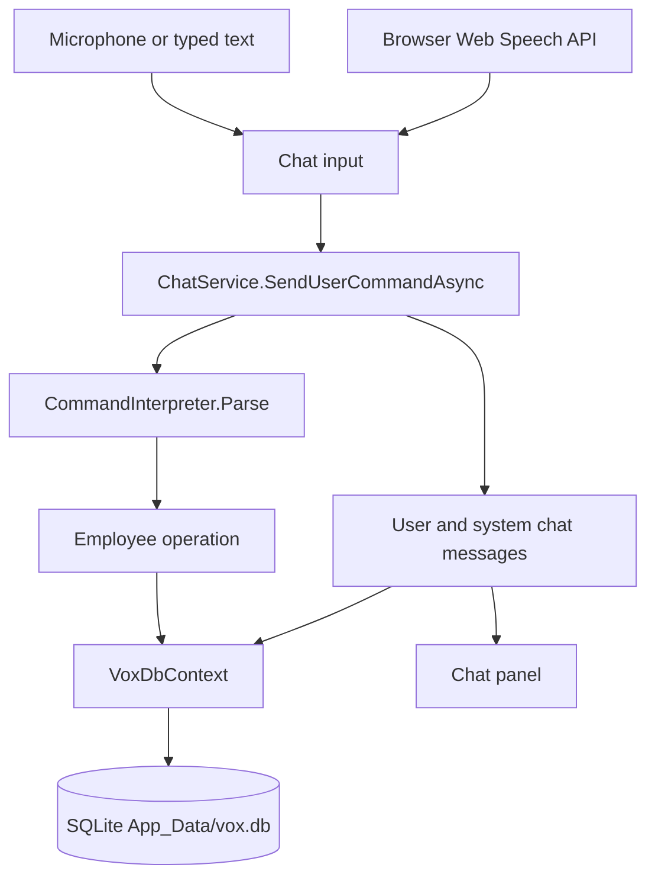
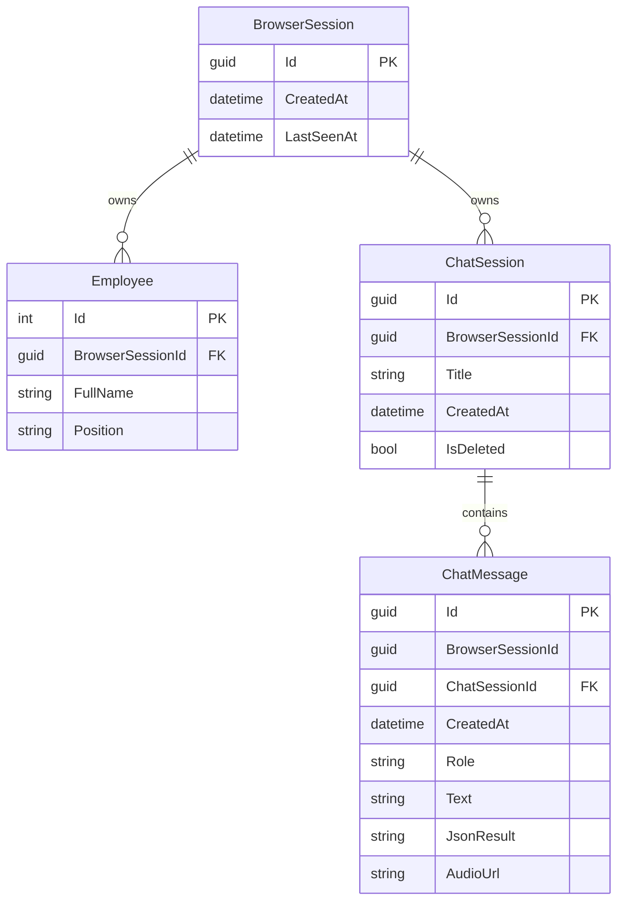

<div align="center">

# VoxDB

### Voice-controlled database interaction with .NET

A .NET application that turns spoken or typed commands into structured operations on a SQLite database.

[](https://dotnet.microsoft.com/)
[](https://dotnet.microsoft.com/apps/aspnet/web-apps/blazor)
[](https://learn.microsoft.com/ef/core/)
[](https://www.sqlite.org/)

</div>

## Overview

VoxDB is a Blazor Server application for working with a small employee directory by voice or by typing. The page is a chat: you enter a command, the application parses it, and Entity Framework Core reads or changes rows in a SQLite file. The reply is written back into the same chat.

The project is a working demonstration of voice as an interface for a fixed set of database operations. It is not a general SQL client and it does not call a separate backend API. Speech recognition runs in the browser. Parsing and data access run in the ASP.NET Core process.

The current domain is one table, `Employees`. You can list every employee, add an employee by name, change an employee’s position by numeric id, or delete an employee by numeric id. Commands are accepted in Ukrainian or English, depending on the language selected in the UI. The default language is Ukrainian. Chat sessions and their messages are stored in the same SQLite file.

Each browser gets its own anonymous session id, saved in `localStorage`. Employees, chats, and messages are stored with that id, and queries only return rows for the current browser. Several people can use one deployed database without seeing each other’s data.

## Features

- Typed commands and microphone input on a single page
- Browser speech-to-text through the Web Speech API (`SpeechRecognition` / `webkitSpeechRecognition`)
- Ukrainian and English command phrases, switched with a UA / EN toggle
- List, insert, update position, and delete for employees
- A result table when the command returns the employee list
- Multiple chat sessions, with history saved in SQLite
- Anonymous per-browser data isolation for employees, chats, and messages
- Plain-language errors for unknown commands, missing ids, and missing employees
- Automatic EF Core migrations when the application starts
- A Docker image that serves the site on port 8080

## Getting Started

### Prerequisites

- [.NET 9 SDK](https://dotnet.microsoft.com/download/dotnet/9.0)
- A Chromium-based browser (Chrome or Edge) if you want voice input. Typing works in any browser that can run Blazor Server.
- Microphone permission for the site. `getUserMedia` only works in a secure context, which includes `localhost`.
- A network connection for voice input. VoxDB does not configure a speech provider, but Chromium’s Web Speech API usually sends audio to the browser’s online recognition service.

No speech API key, cloud account, or database server is required.

### Clone

```bash
git clone https://github.com/OleksandrHutsul/VoxDB.git
cd VoxDB
```

### Configuration

`VoxDB.Components/appsettings.json` contains logging settings, `AllowedHosts`, and this connection string:

```json
"ConnectionStrings": {
  "Sqlite": "Data Source=vox.db"
}
```

`Program.cs` does not read `ConnectionStrings:Sqlite`. The application always opens `App_Data/vox.db` under the content root. Editing that connection string does not change the database location.

`appsettings.Development.json` only adjusts log levels. There are no API keys or other secrets to fill in.

### Database

VoxDB uses SQLite through EF Core. On startup `Program.cs` creates the `App_Data` directory if needed, registers `VoxDbContext` with:

```text
Data Source={ContentRootPath}/App_Data/vox.db
```

and calls `Database.Migrate()`. You do not need to run `dotnet ef database update` to start the app.

`VoxDbContext` lives in `VoxDB.Entities/DbContext/VoxDbContext.cs`. Migrations create `BrowserSessions`, `Employees`, `ChatSessions`, and `ChatMessages`. You do not need a separate database for each user. The browser session id is the owner of the rows.

The first time a browser opens VoxDB, the page stores a new id under `localStorage` key `voxdb.sessionId` and the server creates a `BrowserSession` plus two demo employees:

| Full name | Position |
| --- | --- |
| Ivan Ivanov | Engineer |
| Alex Baena | Analyst |

Later visits with the same browser reuse that id, so the employees and chats stay. A different browser, or a cleared site storage, starts another session with its own demo employees and an empty chat list. “New chat” only adds a chat inside the current session.

Rows that already existed before this isolation change are attached to a private session id created by the migration. They are not shown to new browsers. A session that has not been opened for 30 days is deleted on startup and when another session is opened, including its employees, chats, and messages.

The repository already contains `VoxDB.Components/App_Data/vox.db`. Startup applies any pending migrations to that file. If you delete the file and start the app again, migrations recreate the empty schema; demo employees appear after the browser session is created.

### Run locally

From the repository root:

```bash
dotnet restore
dotnet run --project VoxDB.Components
```

`Properties/launchSettings.json` lists the `http` profile first, so this opens [http://localhost:5054](http://localhost:5054). The `https` profile uses [https://localhost:7031](https://localhost:7031) and [http://localhost:5054](http://localhost:5054):

```bash
dotnet run --project VoxDB.Components --launch-profile https
```

The page loads the latest chat, or creates one if none exist. Switch **UA** / **EN** to match the language of the command, then type a phrase and press **Send**, or press **Speak**, wait for the transcript, and press **Send**. Voice input fills the text box. It does not submit the command by itself.

## How It Works



1. The home page (`VoxDB.Components/Components/Pages/Home.razor`) reads or creates `voxdb.sessionId` in `localStorage`, then asks `BrowserSessionService` to create that session if it is new. The page renders the command list, chat history, chat transcript, and input with Blazor interactive server rendering, so UI events run in the ASP.NET Core process over the Blazor circuit.
2. **Speak** calls `BrowserVoiceService`, which invokes `vox.startListening` in `VoxDB.Components.Common/wwwroot/js/interop.js`.
3. The script records the microphone and runs one-shot browser speech recognition. The transcript is returned to .NET through the JS-invokable `VoiceCallbacks.OnTranscript` method and placed in the input.
4. **Send** calls `ChatService`. The service stores the user text, asks `CommandInterpreter` to parse it, and runs the matching employee operation.
5. The operation uses `VoxDbContext`. The service then stores a system message with the reply. For a list command, the employee rows are also stored as JSON.
6. The chat panel reloads the session. A list result is rendered as a table with id, name, and position.

There is no HTTP API for these operations. `Program.cs` maps only the Blazor application.

## Voice Command Processing

Audio is captured in the browser with `navigator.mediaDevices.getUserMedia` and `MediaRecorder` (`audio/webm`). Recognition uses `window.SpeechRecognition` or `window.webkitSpeechRecognition`. The script keeps one alternative, ignores interim results, and strips trailing `.`, `,`, `!`, and `?` from the transcript.

If the browser does not expose the Web Speech API, the speak button stays disabled. A short recording can be played under the input before you send. The send path stores the text only; the blob URL is not written to `ChatMessages.AudioUrl`.

Recognition language is separate from command parsing:

- The script starts in `auto` mode: it tries `uk-UA`, then `en-US` if the first attempt returns no text.
- The UA / EN toggle calls `vox.setMode` with `ua` or `en`, which selects `uk-UA` or `en-US` only.
- `CommandInterpreter` parses only the phrases for the current UI language. The default is Ukrainian (`LanguageService` starts as `ua`). An English phrase is an unknown command until you switch the toggle to EN, and the reverse is true for Ukrainian.

Parsing is regular-expression matching in `CommandInterpreter`. The whole string must match, ignoring case and surrounding whitespace. There is no LLM, no general NLP model, and no SQL parser. A match becomes a `ParsedCommand` with a `CommandKind` and a small argument dictionary (`name`, `id`, `pos`). `ChatService.ExecuteAsync` runs that command against `Employees`.

| Kind | What it does |
| --- | --- |
| `SelectAllEmployees` | Loads the current session’s employees ordered by id |
| `AddEmployee` | Inserts `FullName`. Position is set to `Невідомо` in Ukrainian mode and `Unknown` in English mode |
| `UpdateEmployeePosition` | Sets `Position` for an existing numeric id |
| `DeleteEmployeeById` | Deletes the employee row |
| `Unknown` | Returns an error and does not change employees |

## Supported Commands

The phrases below are the ones shown in the command list and accepted by the parser. Optional words that the regular expressions also allow are noted under the table.

| Voice or typed command | Operation |
| --- | --- |
| `Покажи всіх працівників` | SELECT |
| `Додай працівника Іван Іванов` | INSERT |
| `Онови посаду працівника з ID 3 на менеджер` | UPDATE position |
| `Видали працівника з ID 5` | DELETE |
| `Show all employees` | SELECT |
| `Add employee John Smith` | INSERT |
| `Update employee with ID 3 to manager` | UPDATE position |
| `Delete employee with ID 5` | DELETE |

Ukrainian list commands also accept `вибери`, `вибрати`, and `показати`, and `усіх` instead of `всіх`. Add accepts `додайте`. Update accepts `оновіть`, and `посаду` and `з` are optional. `ідентифікатором` can be used instead of `id`.

English list commands also accept `list` and can omit `all` (`list employees`). Add accepts `create`. Update accepts `set`, optional `the position of`, optional `with`, `identifier` instead of `id`, and `as` instead of `to`. Delete accepts `remove`.

The name or the new position is the rest of the line. The id must be an integer. Commands do not accept a position on insert, do not rename an employee, and do not filter the list. Text that does not match the active language’s pattern is rejected.

## Database

Persistence is a single SQLite file, `App_Data/vox.db`, accessed only through `VoxDbContext`.



`BrowserSession` is the anonymous browser. `LastSeenAt` is updated when that browser opens the app. Sessions last seen more than 30 days ago are removed, and the delete includes their employees and chats.

`Employee` is the business table. `FullName` is required. `Position` is limited to 128 characters. Every query in `ChatService` filters on `BrowserSessionId`, so an employee id from another session is treated as missing.

`ChatSession` is a conversation inside one browser session. Deleting a chat in the UI sets `IsDeleted` and hides it; the row stays in the database. The first command replaces the default title (`Новий чат` or `New chat`) with the command text, truncated at 60 characters.

`ChatMessage` stores `BrowserSessionId` as well as `ChatSessionId`. Messages are removed with the chat if the chat row is actually deleted (`ON DELETE CASCADE`). `Role` is `user` or `system`. `JsonResult` holds the serialized employee list for a successful select. `AudioUrl` exists on the model, but the current input component does not populate it.

## Architecture

The solution has three projects. There is no API project and no test project.

```text
VoxDB.Components
        ↓
VoxDB.Components.Common
        ↓
VoxDB.Entities
```

**VoxDB.Components** is the ASP.NET Core host. It contains `Program.cs`, the Blazor `App`, routes, layout, the home page, `wwwroot`, `appsettings`, and `App_Data`. It references `VoxDB.Components.Common` and the EF Core design package so migrations can be applied from the startup project.

**VoxDB.Components.Common** is a Razor class library. It contains the chat UI (history, transcript, input, command examples, language toggle), `ChatService`, `CommandInterpreter`, `BrowserSessionService`, `BrowserVoiceService`, `LanguageService`, the command DTO and enum, message text in `CommandHelper`, and `wwwroot/js/interop.js`. It references `VoxDB.Entities`.

**VoxDB.Entities** is a class library. It contains `VoxDbContext`, the `Employee`, `ChatSession`, and `ChatMessage` models, and the EF Core migrations. It references `Microsoft.EntityFrameworkCore.Sqlite` 9.0.9.

## Project Structure

```text
VoxDB/
├── Dockerfile
├── VoxDB.sln
├── VoxDB.Components/
│   ├── App_Data/
│   │   └── vox.db
│   ├── Components/
│   │   ├── Layout/MainLayout.razor
│   │   ├── Pages/Home.razor
│   │   ├── App.razor
│   │   └── Routes.razor
│   ├── wwwroot/
│   │   └── app.css
│   ├── Program.cs
│   ├── appsettings.json
│   └── VoxDB.Components.csproj
├── VoxDB.Components.Common/
│   ├── Components/
│   │   ├── ChatHistory/
│   │   ├── ChatInput/
│   │   ├── ChatPanel/
│   │   ├── CommandList/
│   │   └── LanguageToggle/
│   ├── DTOs/CommandResult.cs
│   ├── Enum/CommandKind.cs
│   ├── Helper/CommandHelper.cs
│   ├── Services/
│   │   ├── ChatService.cs
│   │   ├── CommandInterpreter.cs
│   │   ├── BrowserVoiceService.cs
│   │   └── LanguageService.cs
│   └── wwwroot/js/interop.js
└── VoxDB.Entities/
    ├── DbContext/VoxDbContext.cs
    ├── Migrations/
    ├── Model/
    └── VoxDB.Entities.csproj
```

## Tech Stack

| Area | Technology |
| --- | --- |
| Runtime | .NET 9 |
| UI | Blazor Interactive Server |
| Speech recognition | Browser Web Speech API |
| Command parsing | Regular expressions in `CommandInterpreter` |
| ORM | Entity Framework Core 9 |
| Database | SQLite (`App_Data/vox.db`) |
| Deployment | Docker (`mcr.microsoft.com/dotnet/aspnet:9.0`) |

## Docker

The `Dockerfile` is a multi-stage build. It restores and publishes `VoxDB.Components` with the .NET 9 SDK image, then runs `VoxDB.Components.dll` on the ASP.NET 9 runtime. The container listens on HTTP port 8080 (`ASPNETCORE_URLS=http://+:8080`).

From the repository root:

```bash
docker build -t voxdb .
docker run -p 8080:8080 voxdb
```

Open [http://localhost:8080](http://localhost:8080). Speech recognition still runs in your browser. The container hosts the Blazor app and the SQLite file.

The published output includes `App_Data` because the web project copies that folder. A container started without a volume therefore begins with the database from the image. Anything written after that lives in the container filesystem and disappears when the container is replaced.

To keep the database across container replacements, mount a volume on the directory the app actually uses:

```bash
docker run \
  -p 8080:8080 \
  -v voxdb-data:/app/App_Data \
  voxdb
```

An empty volume hides the database baked into the image. The next startup creates `/app/App_Data/vox.db` and applies migrations. Each browser then receives its own session and demo employees in that file.

`localhost` is a secure context, so the microphone can work against `http://localhost:8080`. A remote browser using plain HTTP will not get microphone access.

## Deployment

VoxDB is a single web process and can be deployed as that Docker image. The repository does not include a CI pipeline or a hosting-provider configuration that the application reads at runtime.

If database changes must survive a redeploy, the host has to give the process a persistent directory for `App_Data/vox.db`. Replacing a container without a volume replaces the database with whatever was published into the image.

## Security and Configuration Notes

- The site has no user accounts. Isolation is the session id in `localStorage`. Anyone who can copy that id into another browser can open the same employees and chats. Do not treat it as a login.
- Do not treat the committed `vox.db` as production data. It is a local demo file. Rows created before per-browser isolation stay on a migration session and are not shown to new visitors.
- There are no speech-provider credentials to store. Do not add API keys to `appsettings.json` and commit them.
- Grant microphone access only on a host you trust. In Chromium, recognition audio is handled by the browser’s speech service, not by application code in this repository.
- Non-development hosting enables HSTS and the exception handler path `/Error`. The repository does not include an Error page, so that path has no UI of its own.

## Current Limitations

- Commands are a fixed phrase list for the `Employees` table. The parser does not accept arbitrary questions, filters, renames, or SQL.
- Only one UI language is parsed at a time, and the page starts in Ukrainian.
- Insert always stores the position as `Невідомо` or `Unknown`. Update changes position only.
- Update and delete require a numeric id. There is no lookup by name.
- Voice input depends on the browser Web Speech API. Firefox does not implement it, so the speak button stays disabled there. Recognition in Chromium generally needs network access.
- The speak button copies text into the input. You still press Send. The recording is not saved on the chat message.
- A language change also asks the speech script to switch to `auto` mode, while the toggle itself requests `ua` or `en`. Those two calls are issued separately.
- SQLite is one file with one writer. Browsers are isolated by session id, but the file is still a single-writer database.
- A browser session that is not opened for 30 days is deleted with its employees, chats, and messages.
- Chat delete is a soft delete. There is no user account and no automated test project.
- Without a volume, Docker database changes do not survive replacement of the container.
